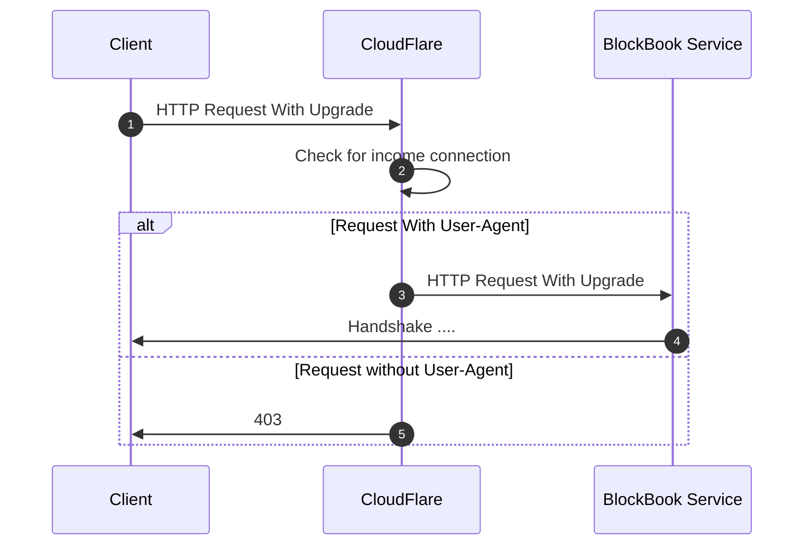

## Simple workaround connection to blockbook public nodes

Problem: 

- websocket error handshake

Because:

- 403 because of cloudflare wants an User-Agent in request header

Solution:

- Put User-Agent tag in the http header

How to run:

1. make build-base
2. make watch-wsclient